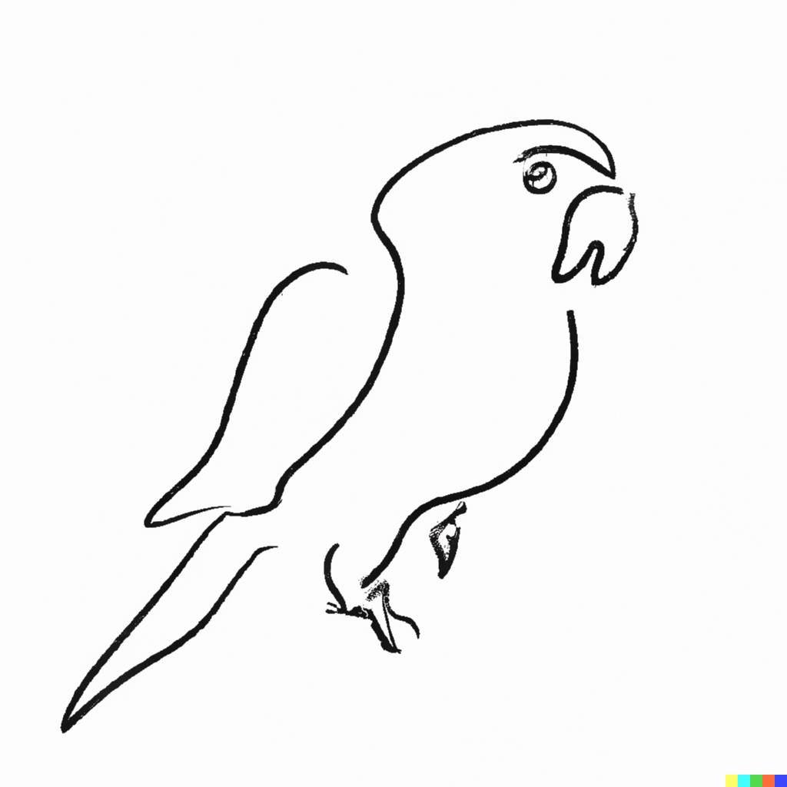

# JAMO (자모): Korean LLM (Little Language Model) 



*"It's just a simple stochastic parrots"* -- by Dall-E 2

JAMO(자모)는 세마고등학교 R&E 연구를 하고 있는 학생이 개발한 한국어 Large Language Model 입니다.

자모 프로젝트는 기본의 GPT-3나 GPT-4와 같은 대규모 언어 모델의 크기를 **더** 줄이기 위한 프로젝트의 일환으로 엣지 디바이스에서도 풀모델 구동이 가능하도록 연구를 진행하고 있습니다. 


### Install

**깃허브 레파지토리 클론**

```bash
git clone https://github.com/yoonhero/jamo_llm
```

**패키지 다운로드**

```bash
pip install -r requirements.txt
```

세팅이 완료 되었습니다. 🎉


### Use the model


### Pretraining with A100

자모는 한국어 모델로 [nanoGPT](https://github.com/karpathy/nanoGPT)에 기반을 둔 프로젝트입니다. 
GPT 아키텍처를 기반으로 하고, 다양한 기법을 실험적으로 채택하여 모델의 성능을 높였습니다. 

- 자모의 사전 학습은 GIST [Sundong Kim](https://sundong.kim/) 교수님의 A100 지원으로 학습될 수 있었습니다.

자모는 약 12일 300000 epoch 동안 64,512,000,000개의 토큰을 학습하였습니다. 
본 모델이 학습한 데이터셋은 위와 같습니다. 


**Run Pretrain On Your Device**

모델 자체의 크기는 크지 않아서 GPU에 로딩할 수 있겠지만 빠른 학습을 위해서 큰 VRAM 환경에서 학습하기를 추천드립니다.

```bash
cd pretrain
python pretrain.py \
    --model_size "small" \
	--learning_rate 0.0003 \ 
	--min_lr 0.00005 \
	--batch_size 70 \ 
	--max_iters 100000 \
	--warmup_iters 2000 \
	--save_interval 5000 \
	--eval_interval 500 \ 
	--gradient_accumulate 6 \
	--checkpoint_dir "../tmp/checkpoint" \ 
	--corpus_path "../tmp/dataset.txt" \
	--tokenizer_path "hg_tokenizer" \       
	--with_lr_scheduler 
```


### Fine-Tune Model


### Citation

Please cite the repo if you use the data or code in this repo.

```
@misc{jamo,
  author = {Sema Highschool LLM R&E Research Team},
  title = {JAMO LLM: JAMO Little Language Model},
  year = {2023},
  publisher = {GitHub},
  journal = {GitHub repository},
  howpublished = {\url{https://github.com/yoonhero/jamo}},
}
```

### Acknowledgments

We gratefully acknowledge support from:

```
@article{liu2023sophia,
 title={Sophia: A Scalable Stochastic Second-order Optimizer for Language Model Pre-training},
 author={Liu, Hong and Li, Zhiyuan and Hall, David and Liang, Percy and Ma, Tengyu},
 journal={arXiv preprint arXiv:2305.14342},
 year={2023}
}
```

```
@misc{kullm,
  author = {NLP & AI Lab and Human-Inspired AI research},
  title = {KULLM: Korea University Large Language Model Project},
  year = {2023},
  publisher = {GitHub},
  journal = {GitHub repository},
  howpublished = {\url{https://github.com/nlpai-lab/kullm}},
}
```