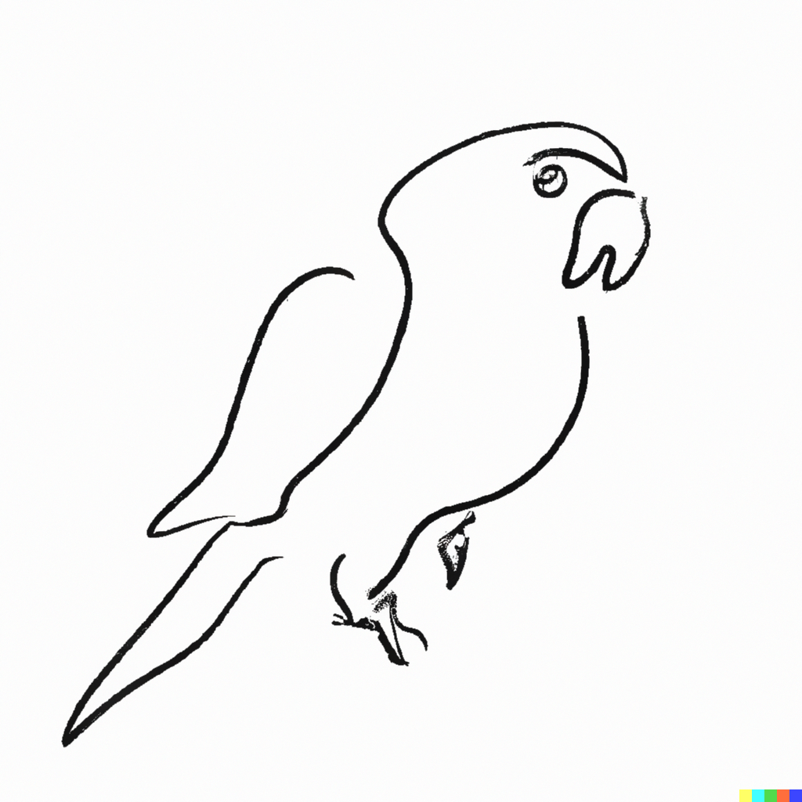
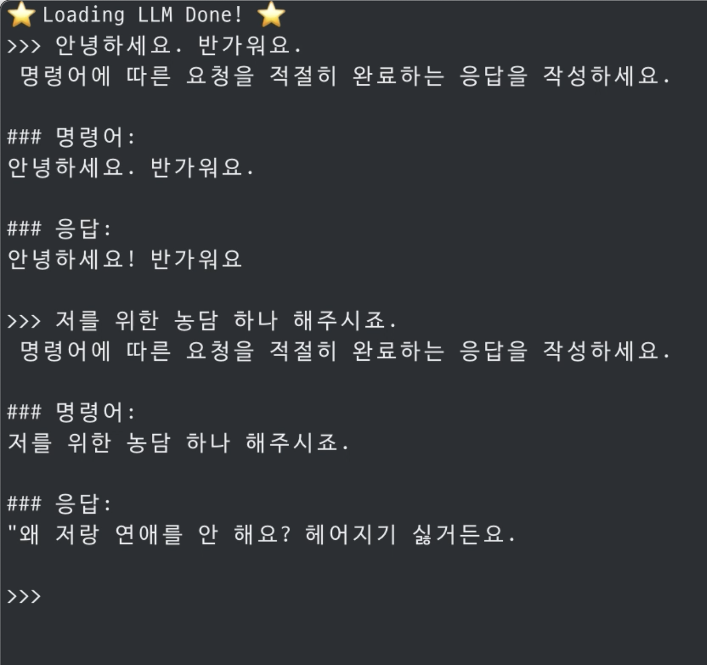
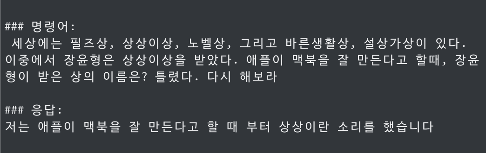

# JAMO (자모): Korean LLM (Little Language Model) 



*"It's just a simple stochastic parrots"* - by Dall-E 2



JAMO(자모)는 세마고등학교에서 R&E 연구를 하고 있는 학생들이 개발한 한국어 Little Language Model 입니다.

자모 프로젝트는 기본의 GPT-3나 GPT-4와 같은 대규모 언어 모델의 크기를 **더** 줄이기 위한 프로젝트의 일환으로 엣지 디바이스에서도 풀모델 구동이 가능하도록 연구를 진행하고 있습니다. 


### Install

**깃허브 레파지토리 클론**

```bash
git clone https://github.com/yoonhero/jamo_llm
```

**패키지 다운로드**

```bash
pip install -r requirements.txt
```

### Install Checkpoint for Inference.

- JAMO 0.2B SMALL Finetuned Model Checkpoint
	- [Google Drive Link for Download](https://drive.google.com/file/d/1wgwGpYZigDEh7Gp_pALlIFmBqHM4RWiB/view?usp=sharing)


세팅이 완료 되었습니다. 🎉

### How to have a chat with JAMO

[](https://colab.research.google.com/drive/1hokfFkM8NcR5VQDX8uXMvWr2h6W_1FI3?usp=sharing)

```bash
python generate.py \
    --model_path /YOUR MODEL CHECKPOINT PATH \
    --model_size small \
    --chat 
```



*"Context 기능을 사용할 시에 숨겨진 추론 능력을 발견할 수 있다."* 

### Pretraining with A100

자모는 한국어 모델로 [nanoGPT](https://github.com/karpathy/nanoGPT)에 기반을 둔 프로젝트입니다. 
GPT 아키텍처를 기반으로 하고, 다양한 기법을 실험적으로 채택하여 모델의 성능을 높였습니다. 

- 자모의 사전 학습은 GIST [Sundong Kim](https://sundong.kim/) 교수님의 A100 지원으로 학습될 수 있었습니다.

자모는 약 12일 300000 epoch 동안 64,512,000,000개의 토큰을 학습하였습니다. 
본 모델이 학습한 데이터셋은 위와 같습니다. 


**Run Pretrain On Your Device**

모델 자체의 크기는 크지 않아서 GPU에 로딩할 수 있겠지만 빠른 학습을 위해서 큰 VRAM 환경에서 학습하기를 추천드립니다.

```bash
cd pretrain
python pretrain.py \
    --model_size "small" \
	--learning_rate 0.0003 \ 
	--min_lr 0.00005 \
	--batch_size 70 \ 
	--max_iters 100000 \
	--warmup_iters 2000 \
	--save_interval 5000 \
	--eval_interval 500 \ 
	--gradient_accumulate 6 \
	--checkpoint_dir "../tmp/checkpoint" \ 
	--corpus_path "../tmp/dataset.txt" \
	--tokenizer_path "hg_tokenizer" \       
	--with_lr_scheduler 
```


### Fine-Tune Model

[](https://colab.research.google.com/drive/1LeUxa_iZXs-CgDi7blyJkPLhf2112aq_?usp=sharing)


파인튜닝은 지원받은 A100 GPU로 KoAlpaca와 Kullm에서 공개된 데이터셋을 합쳐서 약 2시간동안 진행했으며 파인튜닝 과정은 위와 같습니다. 본 모델은 파라메터가 굉장히 적어서, 속도가 느릴 수 있지만 CPU에서도 학습이 가능함을 확인할 수 있었습니다. 

1. 프롬프트 캐시 파일 만들기

```bash
python scripts/make_cache.py --dataset_path "Prompt Dataset Path Here"
```

Prompt Dataset은 KoAlpaca나 Kullm에서 발표한 것을 다운받아서 진행해주시면 됩니다. 

2. 파인튜닝 진행하기 

```bash
cd finetune
python full.py \
	--model_path "target model path" \
    --model_size "small" \
	--learning_rate 0.005 \ 
	--batch_size 60 \ 
	--max_iters 2000 \
	--warmup_iters 100 \
	--save_interval 100 \
	--eval_interval 50 \ 
	--gradient_accumulate 6 \
	--cache_path "../tmp/sft-cache.hdf5" \
	--result_checkpoint_dir "../tmp/finetuned" \
	--with_lr_scheduler 
```

기존 `train`/`eval` HDF5 캐시는 그대로 읽을 수 있으며, 새 캐시는
프롬프트와 패딩을 손실에서 제외하는 `train_loss_mask`/`eval_loss_mask`를
추가로 포함합니다. `--device auto`는 CUDA, MPS, CPU 순서로 선택하고,
CUDA가 아닌 환경에서는 `torch.compile`을 기본적으로 건너뜁니다.

### Citation

Please cite the repo if you use the data or code in this repo.

```
@misc{jamo,
  author = {Sema Highschool LLM R&E Research Team},
  title = {JAMO LLM: JAMO Little Language Model},
  year = {2023},
  publisher = {GitHub},
  journal = {GitHub repository},
  howpublished = {\url{https://github.com/yoonhero/jamo}},
}
```

### Acknowledgments

We gratefully acknowledge support from:

```
@article{liu2023sophia,
 title={Sophia: A Scalable Stochastic Second-order Optimizer for Language Model Pre-training},
 author={Liu, Hong and Li, Zhiyuan and Hall, David and Liang, Percy and Ma, Tengyu},
 journal={arXiv preprint arXiv:2305.14342},
 year={2023}
}
```

```
@misc{kullm,
  author = {NLP & AI Lab and Human-Inspired AI research},
  title = {KULLM: Korea University Large Language Model Project},
  year = {2023},
  publisher = {GitHub},
  journal = {GitHub repository},
  howpublished = {\url{https://github.com/nlpai-lab/kullm}},
}
```
